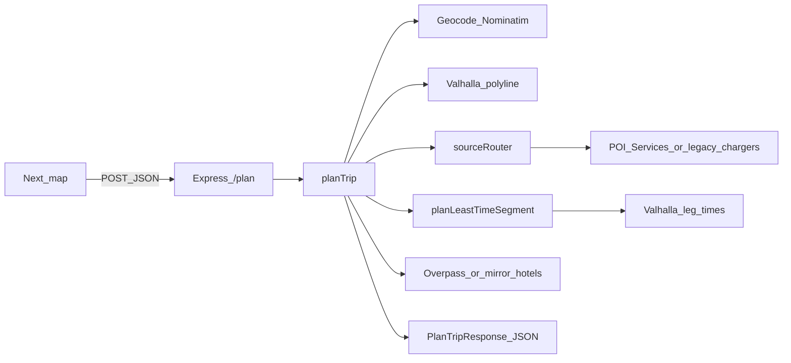

# V1 system — reconstruction handoff

> **Planner corridor source:** With **`POI_SERVICES_BASE_URL`** set, **POI Services** is the runtime source for corridor DC-fast chargers, hotels, and optional pairs/edges. Travel-Routing does **not** use live NREL for that path. Sections below that mention NREL, Overpass, or the **local mirror** describe **legacy/parallel** tiers or **offline refresh**, not the default product routing surface.

This document is the **minimal sufficient** map to understand and re-derive what this repo implements, without re-reading every artifact. Use it as a **clean starting point for v2**.

For **product behavior** (overnight stops, hotels, charging invariants), keep [`PRD.md`](../PRD.md) as the normative requirements source. For **v2 API** fields (`waypoints`, `candidates`), see [`V2_API.md`](./V2_API.md).

---

## 1. What this repository is

- **Monorepo:** `web/` (Next.js 14 app, map + Plan Trip UI), `api/` (Express + TypeScript planner).
- **Core user flow:** Browser → `POST /api` → `POST /plan` → `planTrip()` resolves corridor chargers + POIs (**POI Services** when configured), builds legs with **Valhalla** time/distance, applies overnight/hotel logic per PRD.
- **Optional:** **Local mirror** of NREL + Overpass data (NDJSON + manifest) for **offline refresh** and **`SOURCE_ROUTING_MODE`** tiers when not using POI corridor: `remote_only`, `local_primary_fallback_remote`, **`local_primary_fail_closed`** (mirror-only, **ROUTING_UX_SPEC** §2 fail-closed), `dual_read_compare` — plus observability logs.

---

## 2. Repository layout (must-know paths)

| Path | Role |
|------|------|
| [`api/src/server.ts`](../api/src/server.ts) | Express app, CORS (`DEPLOYMENT_ENV`), `GET /health`, `POST /plan`, `PLAN_TOTAL_TIMEOUT_MS` wrapper. |
| [`api/src/planner/planTrip.ts`](../api/src/planner/planTrip.ts) | Main planner: geocode → corridor chargers → `planLeastTimeSegment` → overnight + Overpass hotels. |
| [`api/src/sourceRouter.ts`](../api/src/sourceRouter.ts) | Chooses `ChargerProvider` / `PoiProvider` (remote vs mirror), fallback, dual-read, rollback logs. |
| [`api/src/mirror/`](../api/src/mirror/) | Local mirror adapter, refresh worker, C2 gate, contracts. |
| [`api/src/services/`](../api/src/services/) | Geocode (Nominatim), NREL, Overpass, Valhalla clients. |
| [`web/src/app/map/page.tsx`](../web/src/app/map/page.tsx) | Map UI, Plan Trip, error classification. |
| [`shared/types.ts`](../shared/types.ts) | Shared types consumed by API (and build). |
| [`Dockerfile`](../Dockerfile) | Multi-stage Node build (api + web artifacts). |
| [`scripts/`](../scripts/) | E2E/smoke (`e2e-*.mjs`, `qa-smoke-all.mjs`). |

---

## 3. End-to-end request flow (simplified)

- **Timeouts:** Total budget `PLAN_TOTAL_TIMEOUT_MS` on the server; per-stage envs in [`TESTING.md`](../TESTING.md) (geocode, Valhalla polyline/legs, POI Services, legacy NREL/Overpass when those paths run).

---

## 4. External services

| Service | Role | Config |
|---------|------|--------|
| **POI Services** | Corridor DC-fast chargers, hotels, pairs, edges (`POST /corridor/query`) | `POI_SERVICES_BASE_URL`, `POI_SERVICES_TIMEOUT_MS`, … |
| **NREL** | *(Legacy / mirror refresh)* DC-fast chargers via HTTP or snapshot ingest | `NREL_API_KEY`, `NREL_FETCH_TIMEOUT_MS`, … — not the product `/plan` path when POI corridor is configured |
| **Overpass** | *(Legacy / mirror refresh)* Hotel POIs | `OVERPASS_FETCH_TIMEOUT_MS`, … |
| **Valhalla** | Route polyline + leg times/distances | `VALHALLA_BASE_URL` (see **[docs/VALHALLA.md](./VALHALLA.md)**) |
| **Nominatim** | Geocoding | `PLAN_GEOCODE_TIMEOUT_MS`, `NOMINATIM_*` |

---

## 5. Local mirror (if used)

- **Design:** [`local-mirror-architecture.md`](./local-mirror-architecture.md) (canonical schemas, router modes, B1–D3).
- **On disk:** `api/mirror/current/manifest.json` points at **`api/mirror/snapshots/<snapshotId>/`** for `chargers.ndjson` + `poi_hotels.ndjson` (not all NDJSON in `current/`).
- **Refresh:** `api` workspace script / Docker `mirror-refresh-once` runs `refreshSnapshot`.
- **Deploy notes:** [`d1-runbook.md`](./d1-runbook.md); production NAS pattern summarized in [`LOCAL_MIRROR_CHECKPOINT.md`](./LOCAL_MIRROR_CHECKPOINT.md).

---

## 6. How to run (reconstruct locally)

1. `cp .env.example .env` — set **`POI_SERVICES_BASE_URL`**, **`VALHALLA_BASE_URL`**, and mirror/routing vars as needed; add **`NREL_API_KEY`** only for mirror refresh or legacy remote tests.
2. `npm run dev:api` and `npm run dev:web` (ports **3001** / **3000**). See [`README.md`](../README.md).
3. `npm run qa:smoke` — API `tsc` + CORS + log-contract E2E (no Docker required). See [`TESTING.md`](../TESTING.md).

**Deploy:** [`docs/d1-runbook.md`](./d1-runbook.md) (POI + planner on Docker networks).

### Production HTTPS (Cloudflare Tunnel)

If users hit the API via a **Cloudflare hostname** (`https://…`), a **`cloudflared`** process on the host (not in this repo’s compose) forwards to the planner. Put **`cloudflared`** and **`planner-api`** on the same Docker network (e.g. `prod-network`), set **`DEPLOYMENT_ENV=production`** and **`CORS_ORIGIN`** to the public origin. Details: [`CLOUDFLARE.md`](./CLOUDFLARE.md).

---

## 7. How to verify behavior

- **Automated:** `npm run qa:smoke`; optional `node scripts/e2e-plan-functional.mjs` with `SPAWN_SERVER=true` per [`TESTING.md`](../TESTING.md).
- **Mirror / routing logs:** JSON events (`plan_source_selection`, `mirror_staleness`, `dual_read_compare`, …) — see architecture doc §C4 and [`CI_SCOPE.md`](./CI_SCOPE.md).

---

## 8. Relationship to other docs

| Artifact | Keep for v2? |
|----------|----------------|
| [`PRD.md`](../PRD.md) | **Yes** — product + env linkage for QA invariants. |
| [`V1_SYSTEM.md`](./V1_SYSTEM.md) (this file) | **Yes** — reconstruction spine; update when architecture shifts. |
| [`local-mirror-architecture.md`](./local-mirror-architecture.md) | **Yes** if mirror/routing continues; trim or archive sections if you drop features. |
| [`TODOS.md`](../TODOS.md) / [`LOCAL_MIRROR_CHECKPOINT.md`](./LOCAL_MIRROR_CHECKPOINT.md) | **Optional** — execution tracking; not required to rebuild binaries. |
| [`TESTING.md`](../TESTING.md) | **Yes** — operational truth for runners and env tables. |

---

## 9. Suggested v2 planning steps

1. Lock **product** changes against [`PRD.md`](../PRD.md) (or replace with PRD v2).
2. Decide **mirror** scope (keep / simplify / remove) using [`local-mirror-architecture.md`](./local-mirror-architecture.md) as the contract reference.
3. Adjust **API surface** (`/plan` schema, env names) and update [`TESTING.md`](../TESTING.md) + `.env.example` in lockstep.
4. Keep **one** smoke entrypoint (`npm run qa:smoke`) green; extend [`CI_SCOPE.md`](./CI_SCOPE.md) when CI exists.

---

*Generated as a handoff anchor; bump the date below when you make major v2 doc changes.*

**Last reviewed:** 2026-03-20
